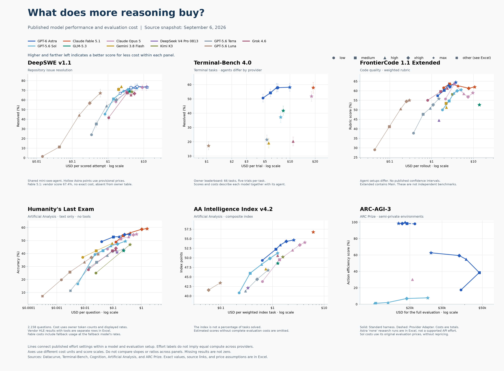

# 📊 model-benchmark-comparison

<div align="center">


[](https://github.com/CamiloMartinezM/model-benchmark-comparison/actions/workflows/checks.yml)

**Model Benchmark Performance & Cost** 🧠

*Compare published model scores, reasoning settings, and evaluation costs in one figure, with editable Excel data and a standalone Python script.*

[Installation](#-installation) • [Features](#-features) • [Usage](#-usage) • [Examples](#-examples) • [Results](#-results) • [Documentation](#-documentation)

</div>



## 📦 Installation

### Quick Install with uv ⚡

```bash
# Clone the repository
git clone https://github.com/CamiloMartinezM/model-benchmark-comparison.git
cd model-benchmark-comparison

# Install dependencies and generate the comparison
uv run model_benchmark_comparison.py
```

### Manual Install from Source 📦

```bash
# Clone the repository
git clone https://github.com/CamiloMartinezM/model-benchmark-comparison.git
cd model-benchmark-comparison

# Create and activate an environment
python -m venv .venv
source .venv/bin/activate

# Install runtime dependencies
python -m pip install -r requirements.txt
```

On Windows PowerShell, activate the environment with `.venv\Scripts\Activate.ps1` instead of the `source` command.

### Development Install 🏗️

From the repository root, install the pinned runtime dependencies and verification tools in your active environment:

```bash
python -m pip install -r requirements-verified.txt
```

---

## 🧠 Supported Benchmarks

The September 6, 2026 snapshot contains **678 observations**, **43 exact model labels**, **27 benchmark names**, and **89 source links**. The consolidated figure contains six panels:

| Benchmark | Score | Cost axis |
| --- | --- | --- |
| DeepSWE v1.1 | Repository issues resolved, percent | USD per scored attempt |
| Terminal-Bench 4.0 | Terminal tasks resolved, percent | USD per trial |
| FrontierCode 1.1 Extended | Weighted code-quality rubric, percent | USD per rollout |
| Humanity's Last Exam | Artificial Analysis text-only accuracy, percent | USD per question |
| AA Intelligence Index v4.2 | Composite index points | USD per weighted index task |
| ARC-AGI-3 | Action efficiency, percent | USD for the full evaluation |

The default comparison shows **11 models**: GPT-6 Astra, GPT-5.6 Sol, Claude Fable 5.1, GLM-5.3, Claude Opus 5, Gemini 3.8 Flash, DeepSeek V4 Pro 0813, Kimi K3, GPT-5.6 Terra, GPT-5.6 Luna, and Grok 4.6.

The workbook also includes GPQA Diamond, SciCode, CritPt, CursorBench, and provider-reported evaluations. Rows without compatible score-cost pairs remain in the data and do not become plotted zeroes.

---

## ✨ Features

### Core Features

- **Consolidated Comparison** - View six benchmark panels with consistent model colors and reasoning-effort markers.
- **Interactive Exploration** - Filter models, zoom, and hover for exact scores, costs, settings, and sources.
- **Editable Excel Data** - Read workbook tables into pandas and regenerate the analysis while preserving your input edits.
- **Standalone Script** - Copy the Python file alone and run it with its dependencies installed; the source snapshot is embedded.
- **Source Attribution** - Inspect original values, token counts, pricing assumptions, retrieval dates, and calculation inputs.
- **Explicit Uncertainty** - Retain published confidence intervals, missing results, provisional prices, and evaluation differences.
- **Multiple Output Formats** - Export HTML, PNG, SVG, PDF, Excel, and CSV files.

### Why use model-benchmark-comparison?

- **Compare Reasoning Settings** - See where additional effort changes cost and performance within a benchmark.
- **Inspect the Evidence** - Follow source links and check how each evaluation's cost was reported or calculated.
- **Reproduce the Analysis** - Generate the dated snapshot offline without making paid model calls or fetching updated benchmark results.

---

## 🚀 Usage

### Generate the Comparison

```bash
python model_benchmark_comparison.py
```

The script writes the figures and analysis beside the script in `model_benchmark_comparison/`. It creates `model_benchmarks.xlsx` from the embedded snapshot if the workbook is absent.

### Edit the Workbook

Edit the **Results** sheet in `model_benchmark_comparison/model_benchmarks.xlsx`, and then rerun the script. It reads the workbook into pandas, preserves the input file, and refreshes the separate analysis files and figures.

An existing workbook takes precedence over the embedded snapshot. To reproduce the release data, choose a fresh output directory and omit `--workbook`.

### Control the Output

The following options control the input, model selection, and exports:

| Option | Behavior |
| --- | --- |
| `--models MODEL ...` | Select exact model names, each quoted. The default includes 11 models. |
| `--all-models` | Include every model label in the workbook. The legend can become crowded. |
| `--workbook PATH` | Read this Excel workbook, creating it from the snapshot if absent. |
| `--output-dir PATH` | Choose where to write the generated files. |
| `--validate-only` | Check the workbook without exporting figures. |
| `--no-html` | Export static figures without the interactive HTML file. |
| `--dpi 300` | Set PNG resolution. Accepted values range from 50 to 600. |
| `--help` | Display all command-line options. |

If `--workbook` is omitted, the script reads or creates a workbook in the output directory.

---

## 💡 Examples

### Compare the Four Focus Models

```bash
python model_benchmark_comparison.py \
  --models "GPT-6 Astra" "GPT-5.6 Sol" "Claude Fable 5.1" "GLM-5.3" \
  --output-dir scratch/focus
```

### Plot an Edited Workbook

```bash
python model_benchmark_comparison.py \
  --workbook model_benchmark_comparison/model_benchmarks.xlsx \
  --output-dir scratch/edited
```

### Export a Higher-Resolution Figure

```bash
python model_benchmark_comparison.py \
  --output-dir scratch/print \
  --dpi 300
```

---

## 📈 Results

### Published Outputs

The repository includes the following files. Download published snapshots from [GitHub Releases](https://github.com/CamiloMartinezM/model-benchmark-comparison/releases).

| File | Purpose |
| --- | --- |
| [Interactive HTML](model_benchmark_comparison/model_benchmark_comparison.html) | Filter models, zoom, and hover for exact values and sources. |
| [Editable Excel Dataset](model_benchmark_comparison/model_benchmarks.xlsx) | Source observations, API prices, model settings, data dictionary, and audit records. |
| [Analysis Workbook](model_benchmark_comparison/model_benchmark_analysis.xlsx) | Derived efficiency measures, eligible Pareto configurations, and coverage. |
| [PDF](model_benchmark_comparison/model_benchmark_comparison.pdf), [SVG](model_benchmark_comparison/model_benchmark_comparison.svg), [PNG](model_benchmark_comparison/model_benchmark_comparison.png) | Export or share the consolidated figure. |
| [Analysis CSV](model_benchmark_comparison/analysis.csv), [Coverage CSV](model_benchmark_comparison/coverage.csv) | Read the results in other analysis tools. |
| [Readable JSON Snapshot](data/model_benchmark_snapshot_2026-09-06.json) | Inspect the same tables embedded in the Python script. |

The HTML embeds Plotly's JavaScript bundle and works offline. GitHub displays its source rather than running it. Download the file and open it locally, or use the release's HTML download.

### Read the Comparison

Higher and farther left indicates a higher score for less cost **within one panel**. Colors identify models, and marker shapes identify effort settings. Lines connect published settings in effort order, including cases where additional effort costs less or scores lower.

On FrontierCode Extended, Fable 5.1 medium scores 63.60 at $2.6825 per rollout. Max scores 62.03 at $10.7206. These point estimates have no published confidence intervals. [Cognition source data](https://cognition.com/data/frontiercode-leaderboard/data.json).

The following limitations affect interpretation:

- Effort labels do not imply equal compute across providers. Agent harnesses, graders, tool access, and benchmark versions can differ.
- DeepSWE uses provisional prices for Astra. Hollow points flag them, and efficiency calculations exclude them.
- DeepSWE has no owner-published Fable 5.1 score-cost pair. Terminal-Bench publishes only max effort for Sol and Fable 5.1 in this snapshot.
- The HLE panel uses 2,158 text-only questions with no tools. Provider HLE variants stay separate. Fable costs incorporate the source's fallback routing and rates.
- The AA Index panel uses version 4.2. Estimated indices without complete evaluation costs are omitted.
- ARC-AGI-3 shows two labeled Astra curves: Standard (solid) and Provider Adapter (dashed). These are separate evaluation setups, described in the [methodology](docs/methodology.md#arc-agi-3-harnesses). Costs describe the full evaluation. Sol retains its original evaluation prices.
- Small score differences do not establish statistically significant rankings. Published uncertainty intervals appear when available.

---

## 📚 Documentation

The CLI lists the available inputs and output controls:

```bash
python model_benchmark_comparison.py --help
```

The following guides cover the data and analysis:

- [Methodology](docs/methodology.md) - Cost units, efficiency calculations, comparison groups, and limitations.
- [Data Dictionary](docs/data-dictionary.md) - Workbook sheets and field definitions.
- [Source Catalog](docs/sources.md) - Source URLs, owners, and retrieval dates.
- [Research Notes](docs/research/README.md) - Benchmark extraction, model identity, pricing, and validation evidence.
- [Contribution Guide](CONTRIBUTING.md) - Development checks and benchmark-data updates.

---

## 🔧 Requirements

### Required

- **Python 3.12** or higher.
- **uv** for the quick-install command, or **pip** for manual installation.

Plot generation and data loading work offline once dependencies are installed.

### Runtime Dependencies

- `pandas` - Load and analyze workbook tables.
- `openpyxl` - Read, write, and format Excel files.
- `numpy` - Calculate numeric comparisons and efficiency measures.
- `matplotlib` - Generate PNG, SVG, and PDF figures.
- `plotly` - Supply the JavaScript bundle for interactive HTML.

Runtime versions are pinned in [requirements.txt](requirements.txt). The [verified dependency list](requirements-verified.txt) also includes Ruff, mypy, pytest, type stubs, and transitive dependencies.

### Development Checks

```bash
python -m ruff check .
python -m ruff format --check .
python -m mypy
python -m pytest -q
python model_benchmark_comparison.py --validate-only
```

Ruff checks Google-style docstrings, and mypy runs in strict mode. GitHub Actions runs these checks, all 11 tests, and fresh generation of every output format on Python 3.12 and 3.13.

---

## 🤝 Contributing

Contributions are welcome. You can:

- Report bugs or source corrections.
- Suggest features or additional benchmarks.
- Submit pull requests.

See [CONTRIBUTING.md](CONTRIBUTING.md) for development setup and data-update guidance.

---

## 📜 License

This project is licensed under the [MIT License](LICENSE).

---

## ⚖️ Disclaimer

This project is for educational and research purposes. Respect the licenses and terms of the benchmark data sources you use.

The analysis consolidates published evaluations and does not run the benchmarks itself. Scores and costs reflect a dated evaluation setup. See the [methodology](docs/methodology.md) and [third-party notices](THIRD_PARTY_NOTICES.md) for source limitations and attribution.

---

<div align="center">

If this comparison is useful, consider giving it a ⭐ on [GitHub](https://github.com/CamiloMartinezM/model-benchmark-comparison)

</div>
